# 6/4/2025 (June 4 2025)  
# Entry #1 
## 4:25pm-5:51pm | 1.5 hours 
Researched parts 
-Kailh hot swap sockets  
-Xiao 
Researched layouts + mounting 
-Alice (ref https://www.reddit.com/r/MechanicalKeyboards/comments/xjspgk/first_full_build_feker_alice_80_the_ultimate/) ; still staggered 

-60% ofc :3

Running with top mount i think

-Would love to CAD a PC/something with a screen so i can put a pic of toro inoue :3 dump in a light too

Read up on custom keeb designing guides :3  
-https://github.com/ruiqimao/keyboard-pcb-guide  
-Will reference this https://github.com/Bemeier/bmek or this https://github.com/coarse/Cordillera for the PCB 

been stealing from pieboard for the design process 💀 
---
# 6/4/2025 
# Entry #2 
## 8:23pm-11:21pm | 3 hours  
imported necessary libraries (kailh, raspi pico), set up footprints for encoder specifically bc kicad didnt link the encoder symbol with its footprint?  
first draft of switch layout! linked the kailh socket with a random switch symbol but i have the footprint so its gwaenchana! 
schematic rn:[alt text](journalPics/schematic1.png) 

i was. talking to someone. i think my rasppi symbol might be wrong. #fried. will look into it later LMFAOO 
---
# 6/5/2025 
# Entry #3 
## 10:22am-11:44am | 1 hour  
added led string 
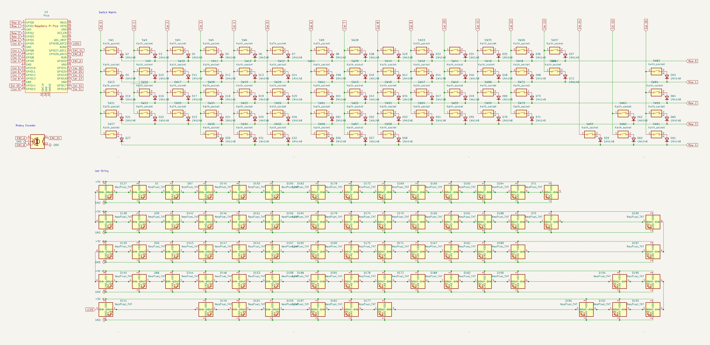
---
# 6/5/2025 
# Entry # 4 
## 3:36pm-6:12 pm | 2.5 hours  
https://www.aliexpress.us/item/2251832437268792.html?spm=a2g0o.productlist.main.1.728d20d6sFdOQO&algo_pvid=e46f8c05-160d-4a64-a095-755449c05a2d&algo_exp_id=e46f8c05-160d-4a64-a095-755449c05a2d-0&pdp_ext_f=%7B%22order%22%3A%22132%22%2C%22eval%22%3A%221%22%7D&pdp_npi=4%40dis%21USD%219.50%218.90%21%21%219.50%218.90%21%402103146c17491635445088028e7d4b%2112000038353355770%21sea%21US%210%21ABX&curPageLogUid=cuu5gB2nRLdE&utparam-url=scene%3Asearch%7Cquery_from%3A  

idontknowwhatimdoing. started the pcb
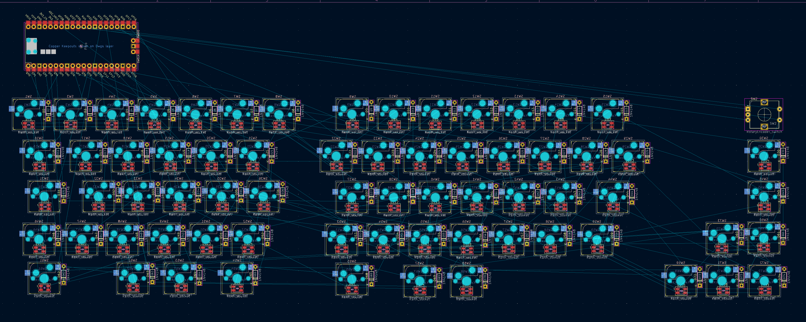
---
# 6/5/2025 
# Entry #5 
## 9pm-12pm | 3 hours 
Made the spacing between center holes 19.05 bc i was on the wrong grid before 💀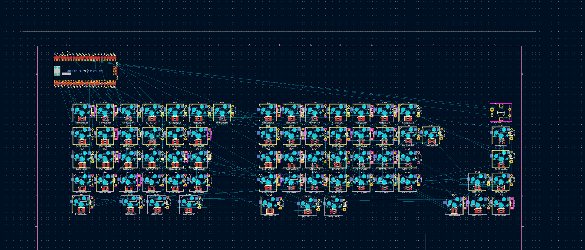
Swapping the windows and alt left keys. reg size keys 
gotta add stagger and review this bc i eyeballed all the support stuff 💀
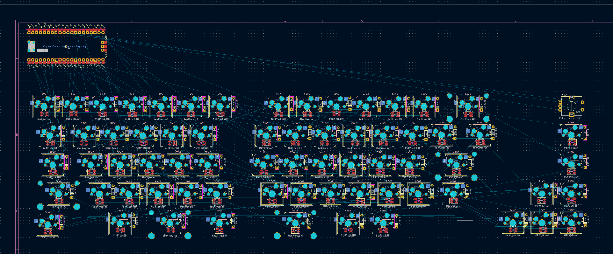
---
# 6/6/2025 
# Entry #6 
## 12:27pm-1:49pm | 1.5 hours 

might put in a usb port? idk 
watched like. 10 vids on desigining a keeb. now understand why kerboards r $120. pls kil lme
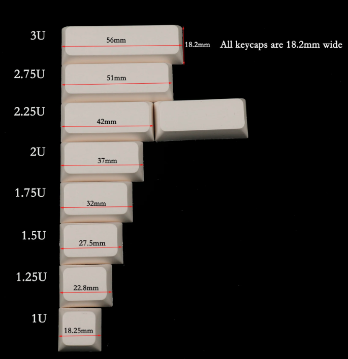 
no clue what im doing but i have to go study for the sat 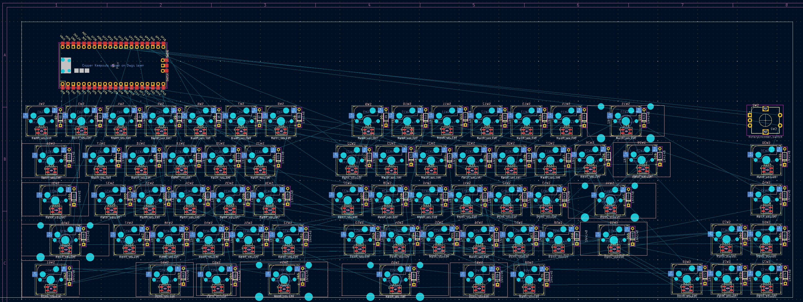
---
# 6/7/2025
# Entry #7
## 5:08pm-7:30 | 2.5 hours 
ok the flat layout is correct now i pray to god (like spacing and stuff)  
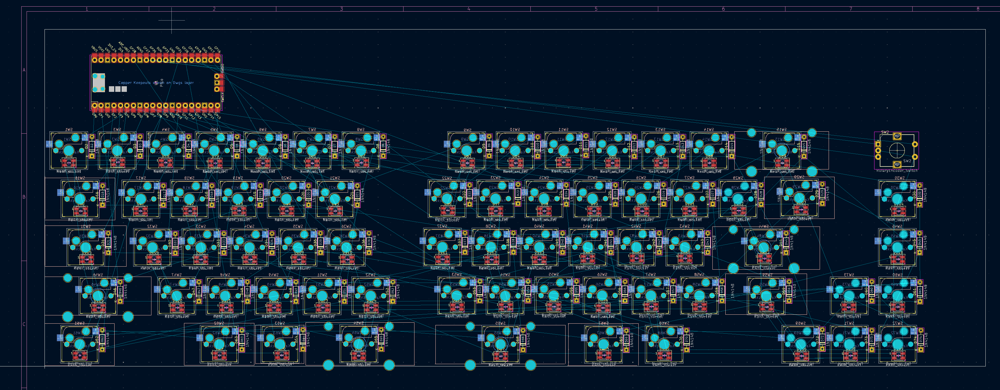
time to rotate this shit and commit LMFAO  
was not that bad actually. 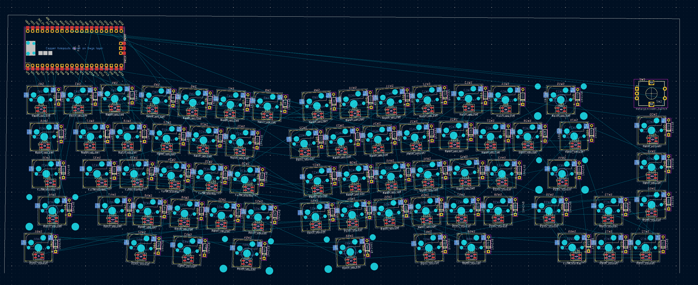
i feel like a monkey given access to kicad 
referencing these keebs for looks: https://www.reddit.com/r/raspberry_pi/comments/x0rml6/pico_and_mechanical_keyboards_a_match_made_in/ and https://www.reddit.com/r/raspberry_pi/comments/mc9l6o/i_designed_a_raspberry_pi_pico_powered_mechanical/  
# 6/8/2025  
# Entry #8  
## 2:29am-3:23am | 1 hour  
kittne ddaddys about to kill herself
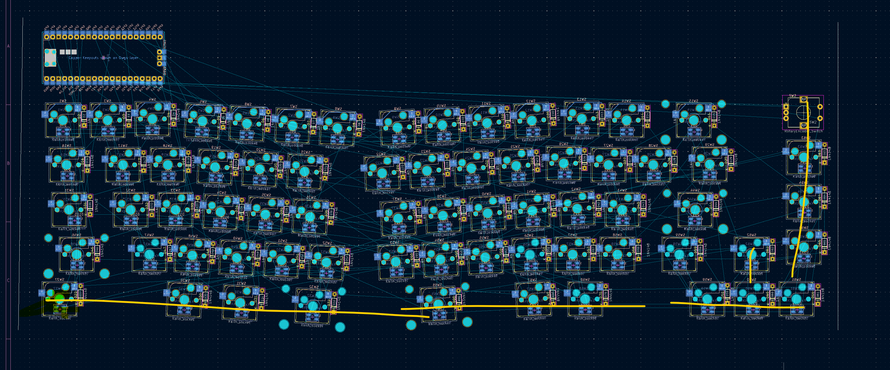
basically i placed all my keys in the wrong place and theyre liike. in the perfect layout and i refuse to move them. so. im mnaullay renaming every switch and diode 💀💀 pls god kill me JK
im fried

# 6/10/2025  
# Entry #9  
## 8:36pm-11:20pm | 3 hours  
just got back from trip!!!!!! :D
i think it's wired???? i had to lowk rename everyl ike. switch. and diode. bc i had them in the wrong palce. wtv
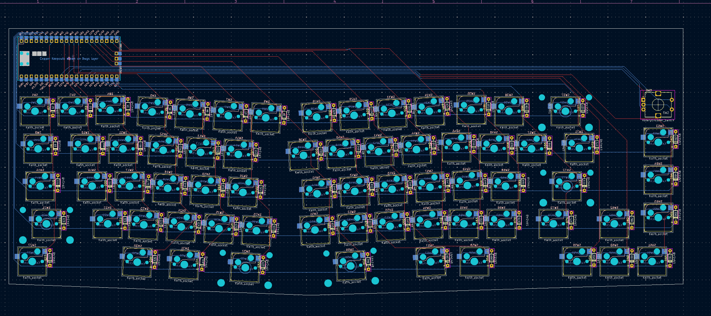
ummm i hope this works bc i have to go make a mouse now. bye.
# 6/11/2025  
# Entry #10  
## 8:07 pm-  
we so back bitches!!! 
fixed some of the wiring. decided what i want the case to look like. prob gonna have to paint stuff on. time to get caddin!  
silk screen stuff eheh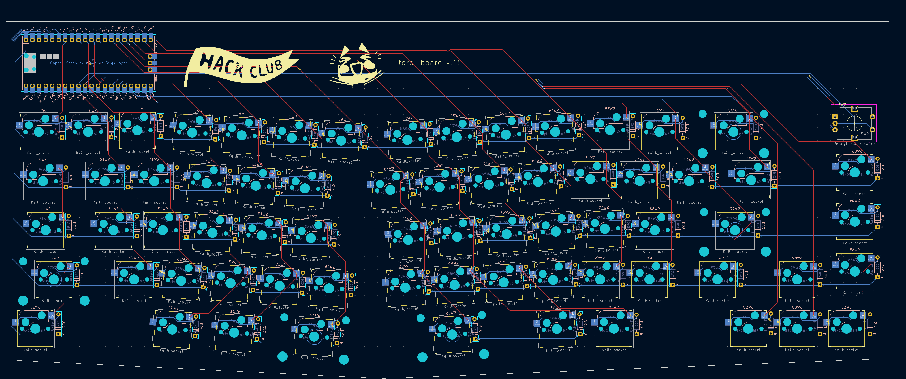
type shit 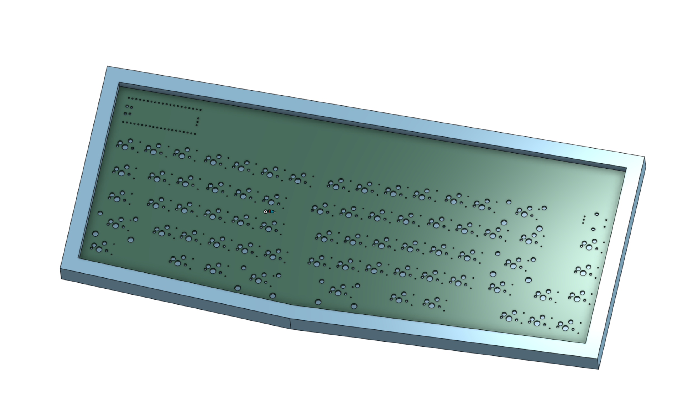
# 6/12/2025  
# Entry #11  
## 3 hours i swear
cadded the shyt in onshape. the keys should be rotated but im p sure theyre not just bc my switch model didnt have pins. im suuuuure it'll work (famous last words)
type shit 
# 6/15/2025  
# Entry #11  
# 2 hours ?
rotated the keys bc i want the rotation to be 8 degrees instead of 3 💀
# 6/16/2025 
# Entry #12
fixed the gaps between keys/rows in onshape + kicad. started on the plate. threw all the keycaps on the switches too. ss is without the caps bc thats how i was making the plate and im too lazy to unhide them. my computer is about to explode 💀
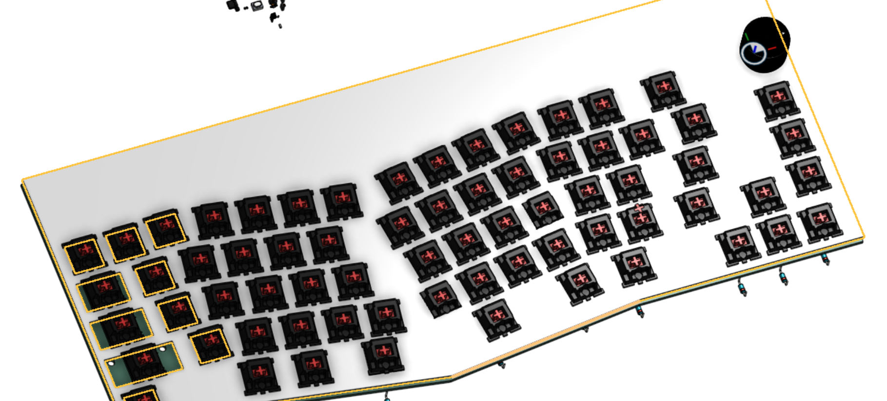 
# 6/17/25
rewired pcb so my raspi can be like. .2 a mm closer to the keys 💀 (actually bc of the key rotation)
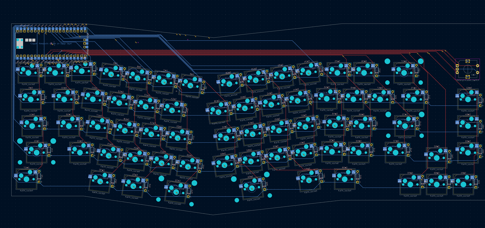