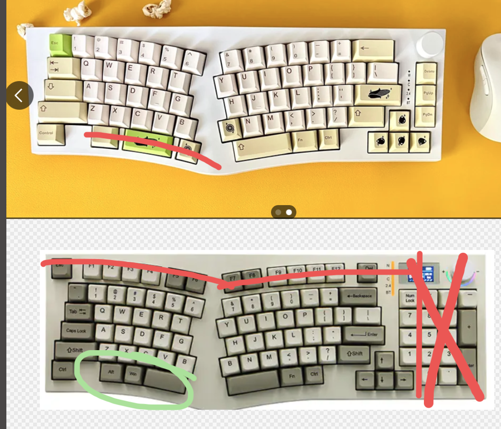
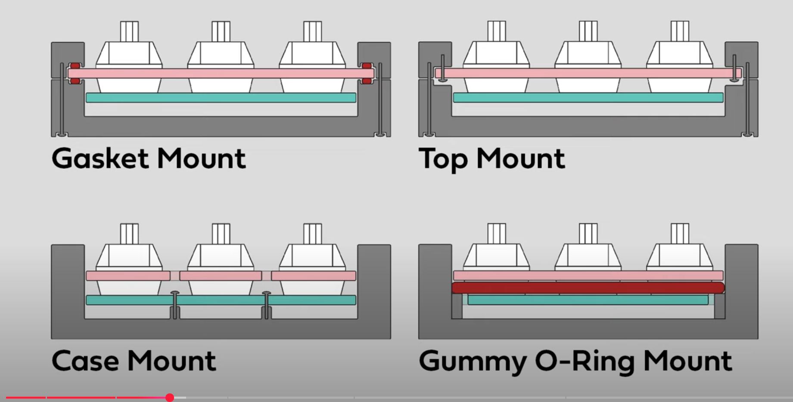
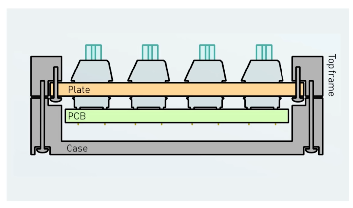
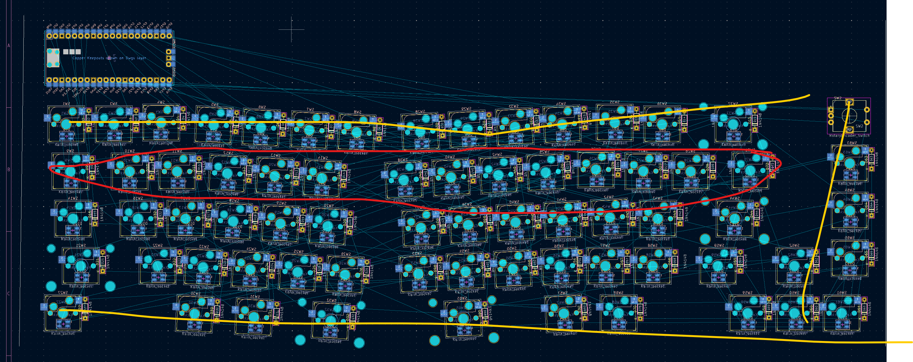
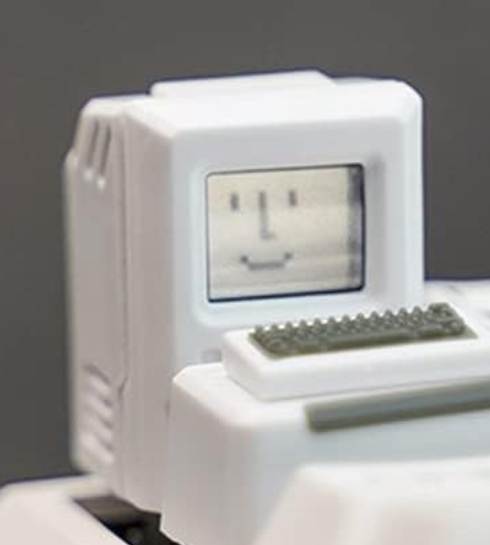

6/4/2025 (June 4 2025) 
Entry #1
4:25pm-5:51pm | 1.5 hours
Researched parts
-Kailh hot swap sockets 
-Xiao
Researched layouts + mounting
-Alice (ref https://www.reddit.com/r/MechanicalKeyboards/comments/xjspgk/first_full_build_feker_alice_80_the_ultimate/) ; still staggered

-60% ofc :3

Running with top mount i think

-Would love to CAD a PC/something with a screen so i can put a pic of toro inoue :3 dump in a light too

Read up on custom keeb designing guides :3
-https://github.com/ruiqimao/keyboard-pcb-guide
-Will reference this https://github.com/Bemeier/bmek or this https://github.com/coarse/Cordillera for the PCB

Referenced Pieboard for the design process !!

Entry #1.1
8:23pm-11:21pm
imported necessary libraries (kailh, raspi pico), set up footprints for encoder specifically bc kicad didnt link the encoder symbol with its footprint? 
first draft of switch layout! linked the kailh socket with a random switch symbol but i have the footprint so its gwaenchana!
schematic rn:[alt text](journalPics/schematic1.png.png) 

i was. talking to someone. i think my rasppi symbol might be wrong. # fried. will look into it later LMFAOO