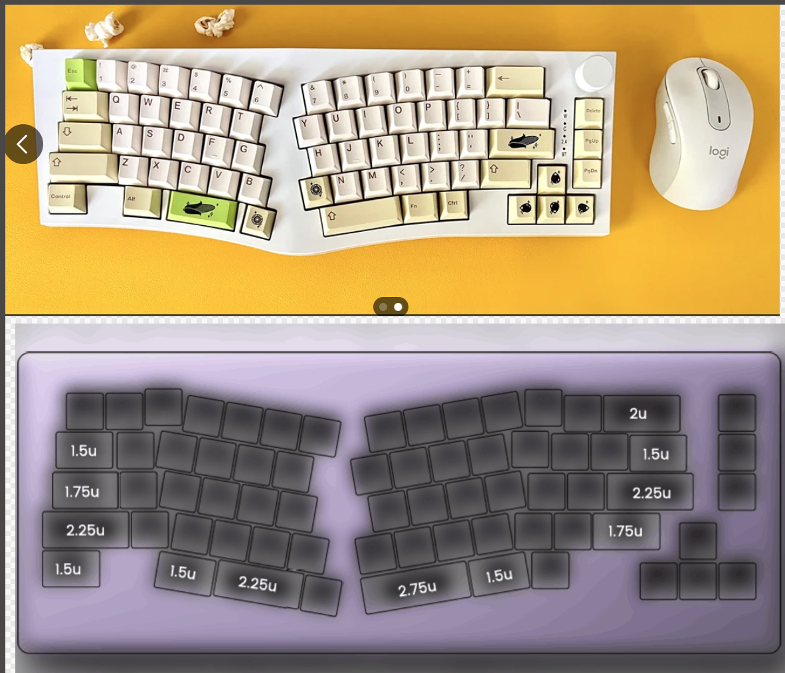

6/4/2025 (June 4 2025) 
Entry #1
4:25pm-5:51pm | 1.5 hours
Researched parts
-Kailh hot swap sockets 
-Xiao
Researched layouts + mounting
-Alice (ref https://www.reddit.com/r/MechanicalKeyboards/comments/xjspgk/first_full_build_feker_alice_80_the_ultimate/) ; still staggered

-60% ofc :3

Running with top mount i think

-Would love to CAD a PC/something with a screen so i can put a pic of toro inoue :3 dump in a light too

Read up on custom keeb designing guides :3 \n
-https://github.com/ruiqimao/keyboard-pcb-guide \n
-Will reference this https://github.com/Bemeier/bmek or this https://github.com/coarse/Cordillera for the PCB

Referenced Pieboard for the design process !!
---
6/4/2025
Entry #2
8:23pm-11:21pm | 3 hours
imported necessary libraries (kailh, raspi pico), set up footprints for encoder specifically bc kicad didnt link the encoder symbol with its footprint? 
first draft of switch layout! linked the kailh socket with a random switch symbol but i have the footprint so its gwaenchana!
schematic rn:[alt text](journalPics/schematic1.png.png) 

i was. talking to someone. i think my rasppi symbol might be wrong. # fried. will look into it later LMFAOO
---
6/5/2025
Entry #3
10:22am-11:44am | 1 hour \n
added led string

---
6/5/2025
Entry #4
3:36pm-6:12 pm | 2.5 hours
https://www.aliexpress.us/item/2251832437268792.html?spm=a2g0o.productlist.main.1.728d20d6sFdOQO&algo_pvid=e46f8c05-160d-4a64-a095-755449c05a2d&algo_exp_id=e46f8c05-160d-4a64-a095-755449c05a2d-0&pdp_ext_f=%7B%22order%22%3A%22132%22%2C%22eval%22%3A%221%22%7D&pdp_npi=4%40dis%21USD%219.50%218.90%21%21%219.50%218.90%21%402103146c17491635445088028e7d4b%2112000038353355770%21sea%21US%210%21ABX&curPageLogUid=cuu5gB2nRLdE&utparam-url=scene%3Asearch%7Cquery_from%3A \n

#idontknowwhatimdoing. started the pcb

---
6/5/2025
Entry #5
Made the spacing between center holes 19.05 bc i was on the wrong grid before 💀
Swapping the windows and alt left keys. reg size keys
gotta add stagger and review this bc i eyeballed all the support stuff 💀
